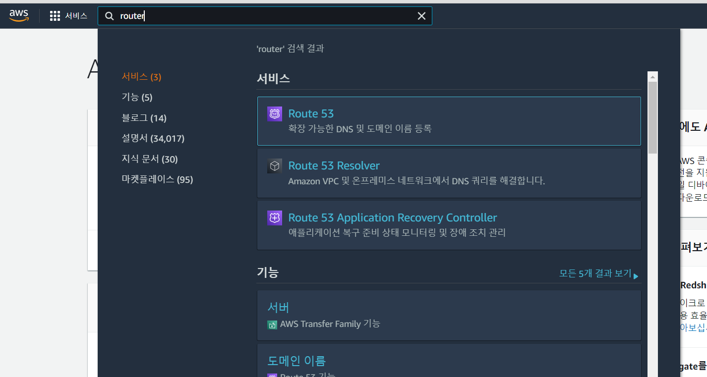
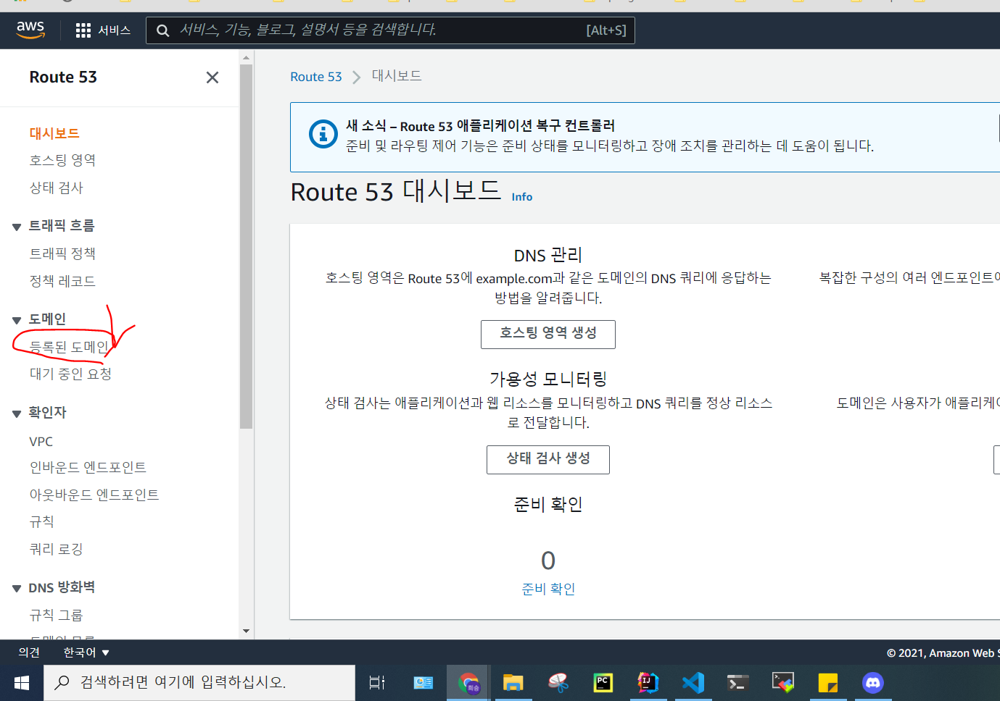

# DNS 등록
- step 1

- step 2

- step 3
  - 원하는 도메인을 등록하고, 결제를 기다리면 된다.
  - 서브 도메인을 쓸 수 있으니 도메인 이름은 큰 단위로 하자.

# S3 설정
- 참고 자료: https://willseungh0.tistory.com/2

# RDS 설정

# EC2 설정

# Docker
- docker-compose

- Dokcerfile

