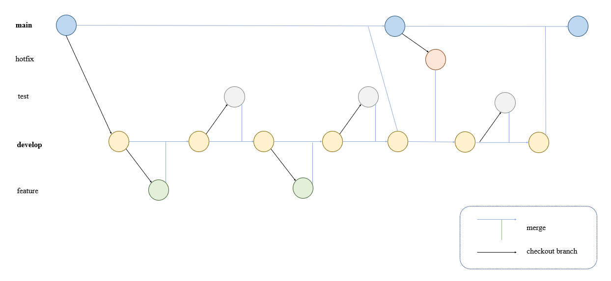
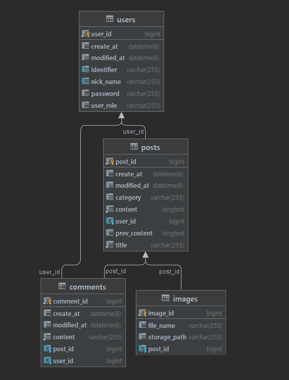

# Board project 기록
- 이번 프로젝트에서 익히고 싶은 것들
  - spring boot를 활용한 api backend 개발
  - reactJS를 활용한 Web frontend 개발
  - AWS를 활용한 server 구축
  - Docker를 활용한 배포
  - 무중단 개발, 배포
  - git version 관리

- 프로젝트 짧은 설명
  - 글을 쓸 수 있는 회원제 사이트
  - 댓글, 좋아요 등으로 사용자가 등록한 글에 반응을 할 수 있다

# 목차
[테이블 설계](#er-diagram)

[버전 관리](#version-control)

[기술 스택](#skills)

[개발 기록](#devlog)

# Version Control

- main
  - 배포용 branch
  - develop에 있는 내용을 merge
  - hotfix, develop branch를 생성한다
- hotfix
  - 배포후 긴급 점검 branch
  - develop에 merge시킨 후 제거
- test
  - feature에서 작성한 기능에 대한 테스트 코드 작성 branch
  - develop에 merge시킨 후 제거
- develop
  - 현재 개발 상황을 저장 중인 branch
  - feature, hotfix, test에 있는 내용을 merge
  - main에 merge시킨 후에도 branch를 제거하지 않고 유지한다
- feature
  - 기능 개발중인 branch
  - 완성후 develop에 merge시키고 제거

# ER Diagram

# Skills
- Spring Boot
  - Web
  - lombock, commons-lang
  - JPA, MySQL, H2
  - Spring Security, JJWT, Validation
  - spring-cloud-aws
- ReactJS
  - react-router-dom
  - redux, react-redux, thunk
  - react-quill
- CI/CD
  - git
  - Docker
- AWS
  - EC2
  - RDS
  - S3

# devlog

## 완성 기능

[회원 가입, 로그인, 로그아웃](./devlog/회원%20가입,%20로그인,%20로그아웃.md)
[게시글 CRUD](./devlog/게시글%20CRUD.md)

## 개발 중인 기능
[댓글, 대댓글 CRUD](./devlog/댓글,%20대댓글%20CURD.md)
[좋아요, 조회수, 실시간 인기글](./devlog/좋아요,%20조회수,%20실시간%20인기글.md)

## 계획중인 기능

